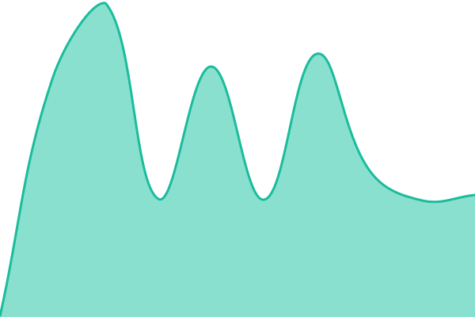
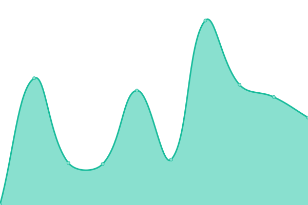

# [📈 Live Status](https://upptime.github.io/upptime): <!--live status--> **🟩 All systems operational**

This repository contains the open-source uptime monitor and status page for [Upptime](https://upptime.js.org), powered by [Upptime](https://github.com/upptime/upptime).

With [Upptime](https://upptime.js.org), you can get your own unlimited and free uptime monitor and status page, powered entirely by a GitHub repository. We use [Issues](https://github.com/upptime/upptime/issues) as incident reports, [Actions](https://github.com/cloudhospitaldev/upptime/actions) as uptime monitors, and [Pages](https://upptime.github.io/upptime) for the status page.

<!--start: status pages-->
<!-- This summary is generated by Upptime (https://github.com/upptime/upptime) -->
<!-- Do not edit this manually, your changes will be overwritten -->
<!-- prettier-ignore -->
| URL | Status | History | Response Time | Uptime |
| --- | ------ | ------- | ------------- | ------ |
|  [ClientPlatform](https://icloudhospital.com/api/healthz) | 🟩 Up | [client-platform.yml](https://github.com/cloudhospitaldev/upptime/commits/HEAD/history/client-platform.yml) | 

 80ms
     
 | 

<a href="https://status.icloudhospital.com/history/client-platform">100.00%</a>
    

|  [AdminPlatform](https://global.icloudhospital.com/api/healthz) | 🟩 Up | [admin-platform.yml](https://github.com/cloudhospitaldev/upptime/commits/HEAD/history/admin-platform.yml) | 

 212ms
     
 | 

<a href="https://status.icloudhospital.com/history/admin-platform">100.00%</a>
    

|  [ClientApi](https://api.icloudhospital.com/healthz) | 🟩 Up | [client-api.yml](https://github.com/cloudhospitaldev/upptime/commits/HEAD/history/client-api.yml) | 

 195ms
     
 | 

<a href="https://status.icloudhospital.com/history/client-api">100.00%</a>
    

|  [AdminApi](https://admin-api.icloudhospital.com/healthz) | 🟩 Up | [admin-api.yml](https://github.com/cloudhospitaldev/upptime/commits/HEAD/history/admin-api.yml) | 

 290ms
     
 | 

<a href="https://status.icloudhospital.com/history/admin-api">100.00%</a>
    

|  [aubeclinic.icloudhospital.com](https://aubeclinic.icloudhospital.com/api/healthz) | 🟩 Up | [aubeclinic-icloudhospital-com.yml](https://github.com/cloudhospitaldev/upptime/commits/HEAD/history/aubeclinic-icloudhospital-com.yml) | 

 0ms
     
 | 

<a href="https://status.icloudhospital.com/history/aubeclinic-icloudhospital-com">100.00%</a>
    

|  [aurahealthcentertijuana.icloudhospital.com](https://aurahealthcentertijuana.icloudhospital.com/api/healthz) | 🟩 Up | [aurahealthcentertijuana-icloudhospital-com.yml](https://github.com/cloudhospitaldev/upptime/commits/HEAD/history/aurahealthcentertijuana-icloudhospital-com.yml) | 

 0ms
     
 | 

<a href="https://status.icloudhospital.com/history/aurahealthcentertijuana-icloudhospital-com">100.00%</a>
    

|  [azurahospital.icloudhospital.com](https://azurahospital.icloudhospital.com/api/healthz) | 🟩 Up | [azurahospital-icloudhospital-com.yml](https://github.com/cloudhospitaldev/upptime/commits/HEAD/history/azurahospital-icloudhospital-com.yml) | 

 0ms
     
 | 

<a href="https://status.icloudhospital.com/history/azurahospital-icloudhospital-com">100.00%</a>
    

|  [gnghospitalrhinoplastyclinic.icloudhospital.com](https://gnghospitalrhinoplastyclinic.icloudhospital.com/api/healthz) | 🟩 Up | [gnghospitalrhinoplastyclinic-icloudhospital-com.yml](https://github.com/cloudhospitaldev/upptime/commits/HEAD/history/gnghospitalrhinoplastyclinic-icloudhospital-com.yml) | 

 0ms
     
 | 

<a href="https://status.icloudhospital.com/history/gnghospitalrhinoplastyclinic-icloudhospital-com">100.00%</a>
    

|  [gongganplasticsurgery.icloudhospital.com](https://gongganplasticsurgery.icloudhospital.com/api/healthz) | 🟩 Up | [gongganplasticsurgery-icloudhospital-com.yml](https://github.com/cloudhospitaldev/upptime/commits/HEAD/history/gongganplasticsurgery-icloudhospital-com.yml) | 

 0ms
     
 | 

<a href="https://status.icloudhospital.com/history/gongganplasticsurgery-icloudhospital-com">100.00%</a>
    

|  [goodpersoneyeclinic.icloudhospital.com](https://goodpersoneyeclinic.icloudhospital.com/api/healthz) | 🟩 Up | [goodpersoneyeclinic-icloudhospital-com.yml](https://github.com/cloudhospitaldev/upptime/commits/HEAD/history/goodpersoneyeclinic-icloudhospital-com.yml) | 

 0ms
     
 | 

<a href="https://status.icloudhospital.com/history/goodpersoneyeclinic-icloudhospital-com">100.00%</a>
    

|  [hospitaldelafamilia.icloudhospital.com](https://hospitaldelafamilia.icloudhospital.com/api/healthz) | 🟩 Up | [hospitaldelafamilia-icloudhospital-com.yml](https://github.com/cloudhospitaldev/upptime/commits/HEAD/history/hospitaldelafamilia-icloudhospital-com.yml) | 

 0ms
     
 | 

<a href="https://status.icloudhospital.com/history/hospitaldelafamilia-icloudhospital-com">100.00%</a>
    

|  [kyungheehyojeonorientalclinic.icloudhospital.com](https://kyungheehyojeonorientalclinic.icloudhospital.com/api/healthz) | 🟩 Up | [kyungheehyojeonorientalclinic-icloudhospital-com.yml](https://github.com/cloudhospitaldev/upptime/commits/HEAD/history/kyungheehyojeonorientalclinic-icloudhospital-com.yml) | 

 0ms
     
 | 

<a href="https://status.icloudhospital.com/history/kyungheehyojeonorientalclinic-icloudhospital-com">100.00%</a>
    

|  [merryplasticsurgery.icloudhospital.com](https://merryplasticsurgery.icloudhospital.com/api/healthz) | 🟩 Up | [merryplasticsurgery-icloudhospital-com.yml](https://github.com/cloudhospitaldev/upptime/commits/HEAD/history/merryplasticsurgery-icloudhospital-com.yml) | 

 0ms
     
 | 

<a href="https://status.icloudhospital.com/history/merryplasticsurgery-icloudhospital-com">100.00%</a>
    

|  [narshahospital.icloudhospital.com](https://narshahospital.icloudhospital.com/api/healthz) | 🟩 Up | [narshahospital-icloudhospital-com.yml](https://github.com/cloudhospitaldev/upptime/commits/HEAD/history/narshahospital-icloudhospital-com.yml) | 

 0ms
     
 | 

<a href="https://status.icloudhospital.com/history/narshahospital-icloudhospital-com">100.00%</a>
    

|  [nidofertility.icloudhospital.com](https://nidofertility.icloudhospital.com/api/healthz) | 🟩 Up | [nidofertility-icloudhospital-com.yml](https://github.com/cloudhospitaldev/upptime/commits/HEAD/history/nidofertility-icloudhospital-com.yml) | 

 0ms
     
 | 

<a href="https://status.icloudhospital.com/history/nidofertility-icloudhospital-com">100.00%</a>
    

|  [theyonseimizwomensclinic.icloudhospital.com](https://theyonseimizwomensclinic.icloudhospital.com/api/healthz) | 🟩 Up | [theyonseimizwomensclinic-icloudhospital-com.yml](https://github.com/cloudhospitaldev/upptime/commits/HEAD/history/theyonseimizwomensclinic-icloudhospital-com.yml) | 

 0ms
     
 | 

<a href="https://status.icloudhospital.com/history/theyonseimizwomensclinic-icloudhospital-com">100.00%</a>
    

|  [www.aceeyecareclinic.com](https://www.aceeyecareclinic.com/api/healthz) | 🟩 Up | [www-aceeyecareclinic-com.yml](https://github.com/cloudhospitaldev/upptime/commits/HEAD/history/www-aceeyecareclinic-com.yml) | 

 0ms
     
 | 

<a href="https://status.icloudhospital.com/history/www-aceeyecareclinic-com">100.00%</a>
    

|  [www.afternoonplasticsurgeryclinic.com](https://www.afternoonplasticsurgeryclinic.com/api/healthz) | 🟩 Up | [www-afternoonplasticsurgeryclinic-com.yml](https://github.com/cloudhospitaldev/upptime/commits/HEAD/history/www-afternoonplasticsurgeryclinic-com.yml) | 

 0ms
     
 | 

<a href="https://status.icloudhospital.com/history/www-afternoonplasticsurgeryclinic-com">100.00%</a>
    

|  [www.alwaysforyouclinic.com](https://www.alwaysforyouclinic.com/api/healthz) | 🟩 Up | [www-alwaysforyouclinic-com.yml](https://github.com/cloudhospitaldev/upptime/commits/HEAD/history/www-alwaysforyouclinic-com.yml) | 

 0ms
     
 | 

<a href="https://status.icloudhospital.com/history/www-alwaysforyouclinic-com">100.00%</a>
    

|  [www.antiaging-korea.com](https://www.antiaging-korea.com/api/healthz) | 🟩 Up | [www-antiaging-korea-com.yml](https://github.com/cloudhospitaldev/upptime/commits/HEAD/history/www-antiaging-korea-com.yml) | 

 0ms
     
 | 

<a href="https://status.icloudhospital.com/history/www-antiaging-korea-com">100.00%</a>
    

|  [www.arinedietclinic.com](https://www.arinedietclinic.com/api/healthz) | 🟩 Up | [www-arinedietclinic-com.yml](https://github.com/cloudhospitaldev/upptime/commits/HEAD/history/www-arinedietclinic-com.yml) | 

 0ms
     
 | 

<a href="https://status.icloudhospital.com/history/www-arinedietclinic-com">100.00%</a>
    

|  [www.arkeplasticsurgery.com](https://www.arkeplasticsurgery.com/api/healthz) | 🟩 Up | [www-arkeplasticsurgery-com.yml](https://github.com/cloudhospitaldev/upptime/commits/HEAD/history/www-arkeplasticsurgery-com.yml) | 

 0ms
     
 | 

<a href="https://status.icloudhospital.com/history/www-arkeplasticsurgery-com">100.00%</a>
    

|  [www.asomeentertainment.com](https://www.asomeentertainment.com/api/healthz) | 🟩 Up | [www-asomeentertainment-com.yml](https://github.com/cloudhospitaldev/upptime/commits/HEAD/history/www-asomeentertainment-com.yml) | 

 0ms
     
 | 

<a href="https://status.icloudhospital.com/history/www-asomeentertainment-com">100.00%</a>
    

|  [www.banpojeilkoreaclinic.com](https://www.banpojeilkoreaclinic.com/api/healthz) | 🟩 Up | [www-banpojeilkoreaclinic-com.yml](https://github.com/cloudhospitaldev/upptime/commits/HEAD/history/www-banpojeilkoreaclinic-com.yml) | 

 0ms
     
 | 

<a href="https://status.icloudhospital.com/history/www-banpojeilkoreaclinic-com">100.00%</a>
    

|  [www.banponewbornclinic.com](https://www.banponewbornclinic.com/api/healthz) | 🟩 Up | [www-banponewbornclinic-com.yml](https://github.com/cloudhospitaldev/upptime/commits/HEAD/history/www-banponewbornclinic-com.yml) | 

 0ms
     
 | 

<a href="https://status.icloudhospital.com/history/www-banponewbornclinic-com">100.00%</a>
    

|  [www.barokoplasticsurgery.com](https://www.barokoplasticsurgery.com/api/healthz) | 🟩 Up | [www-barokoplasticsurgery-com.yml](https://github.com/cloudhospitaldev/upptime/commits/HEAD/history/www-barokoplasticsurgery-com.yml) | 

 0ms
     
 | 

<a href="https://status.icloudhospital.com/history/www-barokoplasticsurgery-com">100.00%</a>
    

|  [www.beautifulstoryclinic.com](https://www.beautifulstoryclinic.com/api/healthz) | 🟩 Up | [www-beautifulstoryclinic-com.yml](https://github.com/cloudhospitaldev/upptime/commits/HEAD/history/www-beautifulstoryclinic-com.yml) | 

 0ms
     
 | 

<a href="https://status.icloudhospital.com/history/www-beautifulstoryclinic-com">100.00%</a>
    

|  [www.bestdoctorskorea.com](https://www.bestdoctorskorea.com/api/healthz) | 🟩 Up | [www-bestdoctorskorea-com.yml](https://github.com/cloudhospitaldev/upptime/commits/HEAD/history/www-bestdoctorskorea-com.yml) | 

 0ms
     
 | 

<a href="https://status.icloudhospital.com/history/www-bestdoctorskorea-com">100.00%</a>
    

|  [www.blepharoplastysouthkorea.com](https://www.blepharoplastysouthkorea.com/api/healthz) | 🟩 Up | [www-blepharoplastysouthkorea-com.yml](https://github.com/cloudhospitaldev/upptime/commits/HEAD/history/www-blepharoplastysouthkorea-com.yml) | 

 0ms
     
 | 

<a href="https://status.icloudhospital.com/history/www-blepharoplastysouthkorea-com">100.00%</a>
    

|  [www.blsclinic1-global.com](https://www.blsclinic1-global.com/api/healthz) | 🟩 Up | [www-blsclinic1-global-com.yml](https://github.com/cloudhospitaldev/upptime/commits/HEAD/history/www-blsclinic1-global-com.yml) | 

 0ms
     
 | 

<a href="https://status.icloudhospital.com/history/www-blsclinic1-global-com">100.00%</a>
    

|  [www.bnsclinickr.com](https://www.bnsclinickr.com/api/healthz) | 🟩 Up | [www-bnsclinickr-com.yml](https://github.com/cloudhospitaldev/upptime/commits/HEAD/history/www-bnsclinickr-com.yml) | 

 0ms
     
 | 

<a href="https://status.icloudhospital.com/history/www-bnsclinickr-com">100.00%</a>
    

|  [www.bon-plasticsurgery.com](https://www.bon-plasticsurgery.com/api/healthz) | 🟩 Up | [www-bon-plasticsurgery-com.yml](https://github.com/cloudhospitaldev/upptime/commits/HEAD/history/www-bon-plasticsurgery-com.yml) | 

 0ms
     
 | 

<a href="https://status.icloudhospital.com/history/www-bon-plasticsurgery-com">100.00%</a>
    

|  [www.botoxsouthkorea.com](https://www.botoxsouthkorea.com/api/healthz) | 🟩 Up | [www-botoxsouthkorea-com.yml](https://github.com/cloudhospitaldev/upptime/commits/HEAD/history/www-botoxsouthkorea-com.yml) | 

 0ms
     
 | 

<a href="https://status.icloudhospital.com/history/www-botoxsouthkorea-com">100.00%</a>
    

|  [www.breastaugmentationkorea.com](https://www.breastaugmentationkorea.com/api/healthz) | 🟩 Up | [www-breastaugmentationkorea-com.yml](https://github.com/cloudhospitaldev/upptime/commits/HEAD/history/www-breastaugmentationkorea-com.yml) | 

 0ms
     
 | 

<a href="https://status.icloudhospital.com/history/www-breastaugmentationkorea-com">100.00%</a>
    

|  [www.browneyeclinic.com](https://www.browneyeclinic.com/api/healthz) | 🟩 Up | [www-browneyeclinic-com.yml](https://github.com/cloudhospitaldev/upptime/commits/HEAD/history/www-browneyeclinic-com.yml) | 

 0ms
     
 | 

<a href="https://status.icloudhospital.com/history/www-browneyeclinic-com">100.00%</a>
    

|  [www.celliniquestemcell.com](https://www.celliniquestemcell.com/api/healthz) | 🟩 Up | [www-celliniquestemcell-com.yml](https://github.com/cloudhospitaldev/upptime/commits/HEAD/history/www-celliniquestemcell-com.yml) | 

 0ms
     
 | 

<a href="https://status.icloudhospital.com/history/www-celliniquestemcell-com">100.00%</a>
    

|  [www.cellondermatology.com](https://www.cellondermatology.com/api/healthz) | 🟩 Up | [www-cellondermatology-com.yml](https://github.com/cloudhospitaldev/upptime/commits/HEAD/history/www-cellondermatology-com.yml) | 

 0ms
     
 | 

<a href="https://status.icloudhospital.com/history/www-cellondermatology-com">100.00%</a>
    

|  [www.centumyeonantiagingclinic.com](https://www.centumyeonantiagingclinic.com/api/healthz) | 🟩 Up | [www-centumyeonantiagingclinic-com.yml](https://github.com/cloudhospitaldev/upptime/commits/HEAD/history/www-centumyeonantiagingclinic-com.yml) | 

 0ms
     
 | 

<a href="https://status.icloudhospital.com/history/www-centumyeonantiagingclinic-com">100.00%</a>
    

|  [www.charmvascularclinic.com](https://www.charmvascularclinic.com/api/healthz) | 🟩 Up | [www-charmvascularclinic-com.yml](https://github.com/cloudhospitaldev/upptime/commits/HEAD/history/www-charmvascularclinic-com.yml) | 

 0ms
     
 | 

<a href="https://status.icloudhospital.com/history/www-charmvascularclinic-com">100.00%</a>
    

|  [www.cheekbonereductionkorea.com](https://www.cheekbonereductionkorea.com/api/healthz) | 🟩 Up | [www-cheekbonereductionkorea-com.yml](https://github.com/cloudhospitaldev/upptime/commits/HEAD/history/www-cheekbonereductionkorea-com.yml) | 

 0ms
     
 | 

<a href="https://status.icloudhospital.com/history/www-cheekbonereductionkorea-com">100.00%</a>
    

|  [www.cheongdamcellclinic.com](https://www.cheongdamcellclinic.com/api/healthz) | 🟩 Up | [www-cheongdamcellclinic-com.yml](https://github.com/cloudhospitaldev/upptime/commits/HEAD/history/www-cheongdamcellclinic-com.yml) | 

 0ms
     
 | 

<a href="https://status.icloudhospital.com/history/www-cheongdamcellclinic-com">100.00%</a>
    

|  [www.cheongdamidunclinic.com](https://www.cheongdamidunclinic.com/api/healthz) | 🟩 Up | [www-cheongdamidunclinic-com.yml](https://github.com/cloudhospitaldev/upptime/commits/HEAD/history/www-cheongdamidunclinic-com.yml) | 

 0ms
     
 | 

<a href="https://status.icloudhospital.com/history/www-cheongdamidunclinic-com">100.00%</a>
    

|  [www.cheongdamsminclinic.com](https://www.cheongdamsminclinic.com/api/healthz) | 🟩 Up | [www-cheongdamsminclinic-com.yml](https://github.com/cloudhospitaldev/upptime/commits/HEAD/history/www-cheongdamsminclinic-com.yml) | 

 0ms
     
 | 

<a href="https://status.icloudhospital.com/history/www-cheongdamsminclinic-com">100.00%</a>
    

|  [www.chinaugmentationkorea.com](https://www.chinaugmentationkorea.com/api/healthz) | 🟩 Up | [www-chinaugmentationkorea-com.yml](https://github.com/cloudhospitaldev/upptime/commits/HEAD/history/www-chinaugmentationkorea-com.yml) | 

 0ms
     
 | 

<a href="https://status.icloudhospital.com/history/www-chinaugmentationkorea-com">100.00%</a>
    

|  [www.cinderellaplasticsurgery.com](https://www.cinderellaplasticsurgery.com/api/healthz) | 🟩 Up | [www-cinderellaplasticsurgery-com.yml](https://github.com/cloudhospitaldev/upptime/commits/HEAD/history/www-cinderellaplasticsurgery-com.yml) | 

 0ms
     
 | 

<a href="https://status.icloudhospital.com/history/www-cinderellaplasticsurgery-com">100.00%</a>
    

|  [www.deesseclinic.com](https://www.deesseclinic.com/api/healthz) | 🟩 Up | [www-deesseclinic-com.yml](https://github.com/cloudhospitaldev/upptime/commits/HEAD/history/www-deesseclinic-com.yml) | 

 0ms
     
 | 

<a href="https://status.icloudhospital.com/history/www-deesseclinic-com">100.00%</a>
    

|  [www.dekabi.com](https://www.dekabi.com/api/healthz) | 🟩 Up | [www-dekabi-com.yml](https://github.com/cloudhospitaldev/upptime/commits/HEAD/history/www-dekabi-com.yml) | 

 0ms
     
 | 

<a href="https://status.icloudhospital.com/history/www-dekabi-com">100.00%</a>
    

|  [www.delightdermatology.com](https://www.delightdermatology.com/api/healthz) | 🟩 Up | [www-delightdermatology-com.yml](https://github.com/cloudhospitaldev/upptime/commits/HEAD/history/www-delightdermatology-com.yml) | 

 0ms
     
 | 

<a href="https://status.icloudhospital.com/history/www-delightdermatology-com">100.00%</a>
    

|  [www.dentalimplantkorea.com](https://www.dentalimplantkorea.com/api/healthz) | 🟩 Up | [www-dentalimplantkorea-com.yml](https://github.com/cloudhospitaldev/upptime/commits/HEAD/history/www-dentalimplantkorea-com.yml) | 

 0ms
     
 | 

<a href="https://status.icloudhospital.com/history/www-dentalimplantkorea-com">100.00%</a>
    

|  [www.dentistinkorea.com](https://www.dentistinkorea.com/api/healthz) | 🟩 Up | [www-dentistinkorea-com.yml](https://github.com/cloudhospitaldev/upptime/commits/HEAD/history/www-dentistinkorea-com.yml) | 

 0ms
     
 | 

<a href="https://status.icloudhospital.com/history/www-dentistinkorea-com">100.00%</a>
    

|  [www.dentistinseoul.com](https://www.dentistinseoul.com/api/healthz) | 🟩 Up | [www-dentistinseoul-com.yml](https://github.com/cloudhospitaldev/upptime/commits/HEAD/history/www-dentistinseoul-com.yml) | 

 0ms
     
 | 

<a href="https://status.icloudhospital.com/history/www-dentistinseoul-com">100.00%</a>
    

|  [www.dermapod.in](https://www.dermapod.in/api/healthz) | 🟩 Up | [www-dermapod-in.yml](https://github.com/cloudhospitaldev/upptime/commits/HEAD/history/www-dermapod-in.yml) | 

 0ms
     
 | 

<a href="https://status.icloudhospital.com/history/www-dermapod-in">100.00%</a>
    

|  [www.dermatologysouthkorea.com](https://www.dermatologysouthkorea.com/api/healthz) | 🟩 Up | [www-dermatologysouthkorea-com.yml](https://github.com/cloudhospitaldev/upptime/commits/HEAD/history/www-dermatologysouthkorea-com.yml) | 

 0ms
     
 | 

<a href="https://status.icloudhospital.com/history/www-dermatologysouthkorea-com">100.00%</a>
    

|  [www.diar-clinic.com](https://www.diar-clinic.com/api/healthz) | 🟩 Up | [www-diar-clinic-com.yml](https://github.com/cloudhospitaldev/upptime/commits/HEAD/history/www-diar-clinic-com.yml) | 

 0ms
     
 | 

<a href="https://status.icloudhospital.com/history/www-diar-clinic-com">100.00%</a>
    

|  [www.diteplasticsurgery.com](https://www.diteplasticsurgery.com/api/healthz) | 🟩 Up | [www-diteplasticsurgery-com.yml](https://github.com/cloudhospitaldev/upptime/commits/HEAD/history/www-diteplasticsurgery-com.yml) | 

 0ms
     
 | 

<a href="https://status.icloudhospital.com/history/www-diteplasticsurgery-com">100.00%</a>
    

|  [www.dlpskorea.com](https://www.dlpskorea.com/api/healthz) | 🟩 Up | [www-dlpskorea-com.yml](https://github.com/cloudhospitaldev/upptime/commits/HEAD/history/www-dlpskorea-com.yml) | 

 0ms
     
 | 

<a href="https://status.icloudhospital.com/history/www-dlpskorea-com">100.00%</a>
    

|  [www.doctorpetitmyeongdong.com](https://www.doctorpetitmyeongdong.com/api/healthz) | 🟩 Up | [www-doctorpetitmyeongdong-com.yml](https://github.com/cloudhospitaldev/upptime/commits/HEAD/history/www-doctorpetitmyeongdong-com.yml) | 

 0ms
     
 | 

<a href="https://status.icloudhospital.com/history/www-doctorpetitmyeongdong-com">100.00%</a>
    

|  [www.dojagi-clinic.com](https://www.dojagi-clinic.com/api/healthz) | 🟩 Up | [www-dojagi-clinic-com.yml](https://github.com/cloudhospitaldev/upptime/commits/HEAD/history/www-dojagi-clinic-com.yml) | 

 0ms
     
 | 

<a href="https://status.icloudhospital.com/history/www-dojagi-clinic-com">100.00%</a>
    

|  [www.doubleeyelidsurgerykorea.com](https://www.doubleeyelidsurgerykorea.com/api/healthz) | 🟩 Up | [www-doubleeyelidsurgerykorea-com.yml](https://github.com/cloudhospitaldev/upptime/commits/HEAD/history/www-doubleeyelidsurgerykorea-com.yml) | 

 0ms
     
 | 

<a href="https://status.icloudhospital.com/history/www-doubleeyelidsurgerykorea-com">100.00%</a>
    

|  [www.doublejawsurgerykorea.com](https://www.doublejawsurgerykorea.com/api/healthz) | 🟩 Up | [www-doublejawsurgerykorea-com.yml](https://github.com/cloudhospitaldev/upptime/commits/HEAD/history/www-doublejawsurgerykorea-com.yml) | 

 0ms
     
 | 

<a href="https://status.icloudhospital.com/history/www-doublejawsurgerykorea-com">100.00%</a>
    

|  [www.dranujtiwari.com](https://www.dranujtiwari.com/api/healthz) | 🟩 Up | [www-dranujtiwari-com.yml](https://github.com/cloudhospitaldev/upptime/commits/HEAD/history/www-dranujtiwari-com.yml) | 

 0ms
     
 | 

<a href="https://status.icloudhospital.com/history/www-dranujtiwari-com">100.00%</a>
    

|  [www.egdonganclinic.com](https://www.egdonganclinic.com/api/healthz) | 🟩 Up | [www-egdonganclinic-com.yml](https://github.com/cloudhospitaldev/upptime/commits/HEAD/history/www-egdonganclinic-com.yml) | 

 0ms
     
 | 

<a href="https://status.icloudhospital.com/history/www-egdonganclinic-com">100.00%</a>
    

|  [www.ekdongmukoreanmedicine.com](https://www.ekdongmukoreanmedicine.com/api/healthz) | 🟩 Up | [www-ekdongmukoreanmedicine-com.yml](https://github.com/cloudhospitaldev/upptime/commits/HEAD/history/www-ekdongmukoreanmedicine-com.yml) | 

 0ms
     
 | 

<a href="https://status.icloudhospital.com/history/www-ekdongmukoreanmedicine-com">100.00%</a>
    

|  [www.eunskinclinic.com](https://www.eunskinclinic.com/api/healthz) | 🟩 Up | [www-eunskinclinic-com.yml](https://github.com/cloudhospitaldev/upptime/commits/HEAD/history/www-eunskinclinic-com.yml) | 

 0ms
     
 | 

<a href="https://status.icloudhospital.com/history/www-eunskinclinic-com">100.00%</a>
    

|  [www.eurekaclinic-korea.com](https://www.eurekaclinic-korea.com/api/healthz) | 🟩 Up | [www-eurekaclinic-korea-com.yml](https://github.com/cloudhospitaldev/upptime/commits/HEAD/history/www-eurekaclinic-korea-com.yml) | 

 0ms
     
 | 

<a href="https://status.icloudhospital.com/history/www-eurekaclinic-korea-com">100.00%</a>
    

|  [www.faceliftsouthkorea.com](https://www.faceliftsouthkorea.com/api/healthz) | 🟩 Up | [www-faceliftsouthkorea-com.yml](https://github.com/cloudhospitaldev/upptime/commits/HEAD/history/www-faceliftsouthkorea-com.yml) | 

 0ms
     
 | 

<a href="https://status.icloudhospital.com/history/www-faceliftsouthkorea-com">100.00%</a>
    

|  [www.faceplusplasticsurgery.com](https://www.faceplusplasticsurgery.com/api/healthz) | 🟩 Up | [www-faceplusplasticsurgery-com.yml](https://github.com/cloudhospitaldev/upptime/commits/HEAD/history/www-faceplusplasticsurgery-com.yml) | 

 0ms
     
 | 

<a href="https://status.icloudhospital.com/history/www-faceplusplasticsurgery-com">100.00%</a>
    

|  [www.gangnamdental.com](https://www.gangnamdental.com/api/healthz) | 🟩 Up | [www-gangnamdental-com.yml](https://github.com/cloudhospitaldev/upptime/commits/HEAD/history/www-gangnamdental-com.yml) | 

 0ms
     
 | 

<a href="https://status.icloudhospital.com/history/www-gangnamdental-com">100.00%</a>
    

|  [www.gangnameyeclinic.com](https://www.gangnameyeclinic.com/api/healthz) | 🟩 Up | [www-gangnameyeclinic-com.yml](https://github.com/cloudhospitaldev/upptime/commits/HEAD/history/www-gangnameyeclinic-com.yml) | 

 0ms
     
 | 

<a href="https://status.icloudhospital.com/history/www-gangnameyeclinic-com">100.00%</a>
    

|  [www.gangnamnaturalbeauty.com](https://www.gangnamnaturalbeauty.com/api/healthz) | 🟩 Up | [www-gangnamnaturalbeauty-com.yml](https://github.com/cloudhospitaldev/upptime/commits/HEAD/history/www-gangnamnaturalbeauty-com.yml) | 

 0ms
     
 | 

<a href="https://status.icloudhospital.com/history/www-gangnamnaturalbeauty-com">100.00%</a>
    

|  [www.gangnamplastics.com](https://www.gangnamplastics.com/api/healthz) | 🟩 Up | [www-gangnamplastics-com.yml](https://github.com/cloudhospitaldev/upptime/commits/HEAD/history/www-gangnamplastics-com.yml) | 

 0ms
     
 | 

<a href="https://status.icloudhospital.com/history/www-gangnamplastics-com">100.00%</a>
    

|  [www.gangnamstmarysurologyclinic.com](https://www.gangnamstmarysurologyclinic.com/api/healthz) | 🟩 Up | [www-gangnamstmarysurologyclinic-com.yml](https://github.com/cloudhospitaldev/upptime/commits/HEAD/history/www-gangnamstmarysurologyclinic-com.yml) | 

 0ms
     
 | 

<a href="https://status.icloudhospital.com/history/www-gangnamstmarysurologyclinic-com">100.00%</a>
    

|  [www.gangnamstyleclinic.com](https://www.gangnamstyleclinic.com/api/healthz) | 🟩 Up | [www-gangnamstyleclinic-com.yml](https://github.com/cloudhospitaldev/upptime/commits/HEAD/history/www-gangnamstyleclinic-com.yml) | 

 0ms
     
 | 

<a href="https://status.icloudhospital.com/history/www-gangnamstyleclinic-com">100.00%</a>
    

|  [www.globalownclinic.com](https://www.globalownclinic.com/api/healthz) | 🟩 Up | [www-globalownclinic-com.yml](https://github.com/cloudhospitaldev/upptime/commits/HEAD/history/www-globalownclinic-com.yml) | 

 0ms
     
 | 

<a href="https://status.icloudhospital.com/history/www-globalownclinic-com">100.00%</a>
    

|  [www.gseyeclinicglobal.com](https://www.gseyeclinicglobal.com/api/healthz) | 🟩 Up | [www-gseyeclinicglobal-com.yml](https://github.com/cloudhospitaldev/upptime/commits/HEAD/history/www-gseyeclinicglobal-com.yml) | 

 0ms
     
 | 

<a href="https://status.icloudhospital.com/history/www-gseyeclinicglobal-com">100.00%</a>
    

|  [www.hairtransplantsouthkorea.com](https://www.hairtransplantsouthkorea.com/api/healthz) | 🟩 Up | [www-hairtransplantsouthkorea-com.yml](https://github.com/cloudhospitaldev/upptime/commits/HEAD/history/www-hairtransplantsouthkorea-com.yml) | 

 0ms
     
 | 

<a href="https://status.icloudhospital.com/history/www-hairtransplantsouthkorea-com">100.00%</a>
    

|  [www.hanaentcare.com](https://www.hanaentcare.com/api/healthz) | 🟩 Up | [www-hanaentcare-com.yml](https://github.com/cloudhospitaldev/upptime/commits/HEAD/history/www-hanaentcare-com.yml) | 

 0ms
     
 | 

<a href="https://status.icloudhospital.com/history/www-hanaentcare-com">100.00%</a>
    

|  [www.haniplasticsurgery.com](https://www.haniplasticsurgery.com/api/healthz) | 🟩 Up | [www-haniplasticsurgery-com.yml](https://github.com/cloudhospitaldev/upptime/commits/HEAD/history/www-haniplasticsurgery-com.yml) | 

 0ms
     
 | 

<a href="https://status.icloudhospital.com/history/www-haniplasticsurgery-com">100.00%</a>
    

|  [www.hannaeveglobal.com](https://www.hannaeveglobal.com/api/healthz) | 🟩 Up | [www-hannaeveglobal-com.yml](https://github.com/cloudhospitaldev/upptime/commits/HEAD/history/www-hannaeveglobal-com.yml) | 

 0ms
     
 | 

<a href="https://status.icloudhospital.com/history/www-hannaeveglobal-com">100.00%</a>
    

|  [www.hipreplacementkorea.com](https://www.hipreplacementkorea.com/api/healthz) | 🟩 Up | [www-hipreplacementkorea-com.yml](https://github.com/cloudhospitaldev/upptime/commits/HEAD/history/www-hipreplacementkorea-com.yml) | 

 0ms
     
 | 

<a href="https://status.icloudhospital.com/history/www-hipreplacementkorea-com">100.00%</a>
    

|  [www.howardpainclinic.com](https://www.howardpainclinic.com/api/healthz) | 🟩 Up | [www-howardpainclinic-com.yml](https://github.com/cloudhospitaldev/upptime/commits/HEAD/history/www-howardpainclinic-com.yml) | 

 0ms
     
 | 

<a href="https://status.icloudhospital.com/history/www-howardpainclinic-com">100.00%</a>
    

|  [www.hugo-ps-global.com](https://www.hugo-ps-global.com/api/healthz) | 🟩 Up | [www-hugo-ps-global-com.yml](https://github.com/cloudhospitaldev/upptime/commits/HEAD/history/www-hugo-ps-global-com.yml) | 

 0ms
     
 | 

<a href="https://status.icloudhospital.com/history/www-hugo-ps-global-com">100.00%</a>
    

|  [www.human-plasticsurgery.com](https://www.human-plasticsurgery.com/api/healthz) | 🟩 Up | [www-human-plasticsurgery-com.yml](https://github.com/cloudhospitaldev/upptime/commits/HEAD/history/www-human-plasticsurgery-com.yml) | 

 0ms
     
 | 

<a href="https://status.icloudhospital.com/history/www-human-plasticsurgery-com">100.00%</a>
    

|  [www.i-legplusclinic.com](https://www.i-legplusclinic.com/api/healthz) | 🟩 Up | [www-i-legplusclinic-com.yml](https://github.com/cloudhospitaldev/upptime/commits/HEAD/history/www-i-legplusclinic-com.yml) | 

 0ms
     
 | 

<a href="https://status.icloudhospital.com/history/www-i-legplusclinic-com">100.00%</a>
    

|  [www.jawsurgerykorea.com](https://www.jawsurgerykorea.com/api/healthz) | 🟩 Up | [www-jawsurgerykorea-com.yml](https://github.com/cloudhospitaldev/upptime/commits/HEAD/history/www-jawsurgerykorea-com.yml) | 

 0ms
     
 | 

<a href="https://status.icloudhospital.com/history/www-jawsurgerykorea-com">100.00%</a>
    

|  [www.jessiebeautyacademy.com](https://www.jessiebeautyacademy.com/api/healthz) | 🟩 Up | [www-jessiebeautyacademy-com.yml](https://github.com/cloudhospitaldev/upptime/commits/HEAD/history/www-jessiebeautyacademy-com.yml) | 

 0ms
     
 | 

<a href="https://status.icloudhospital.com/history/www-jessiebeautyacademy-com">100.00%</a>
    

|  [www.jeunexkorea.com](https://www.jeunexkorea.com/api/healthz) | 🟩 Up | [www-jeunexkorea-com.yml](https://github.com/cloudhospitaldev/upptime/commits/HEAD/history/www-jeunexkorea-com.yml) | 

 0ms
     
 | 

<a href="https://status.icloudhospital.com/history/www-jeunexkorea-com">100.00%</a>
    

|  [www.jnbplasticsurgeryclinic.com](https://www.jnbplasticsurgeryclinic.com/api/healthz) | 🟩 Up | [www-jnbplasticsurgeryclinic-com.yml](https://github.com/cloudhospitaldev/upptime/commits/HEAD/history/www-jnbplasticsurgeryclinic-com.yml) | 

 0ms
     
 | 

<a href="https://status.icloudhospital.com/history/www-jnbplasticsurgeryclinic-com">100.00%</a>
    

|  [www.joeunnuneyeglobal.com](https://www.joeunnuneyeglobal.com/api/healthz) | 🟩 Up | [www-joeunnuneyeglobal-com.yml](https://github.com/cloudhospitaldev/upptime/commits/HEAD/history/www-joeunnuneyeglobal-com.yml) | 

 0ms
     
 | 

<a href="https://status.icloudhospital.com/history/www-joeunnuneyeglobal-com">100.00%</a>
    

|  [www.jryneyeclinic.com](https://www.jryneyeclinic.com/api/healthz) | 🟩 Up | [www-jryneyeclinic-com.yml](https://github.com/cloudhospitaldev/upptime/commits/HEAD/history/www-jryneyeclinic-com.yml) | 

 0ms
     
 | 

<a href="https://status.icloudhospital.com/history/www-jryneyeclinic-com">100.00%</a>
    

|  [www.justplasticsurgeryclinic.com](https://www.justplasticsurgeryclinic.com/api/healthz) | 🟩 Up | [www-justplasticsurgeryclinic-com.yml](https://github.com/cloudhospitaldev/upptime/commits/HEAD/history/www-justplasticsurgeryclinic-com.yml) | 

 0ms
     
 | 

<a href="https://status.icloudhospital.com/history/www-justplasticsurgeryclinic-com">100.00%</a>
    

|  [www.juyeonwomensclinicseoul.com](https://www.juyeonwomensclinicseoul.com/api/healthz) | 🟩 Up | [www-juyeonwomensclinicseoul-com.yml](https://github.com/cloudhospitaldev/upptime/commits/HEAD/history/www-juyeonwomensclinicseoul-com.yml) | 

 0ms
     
 | 

<a href="https://status.icloudhospital.com/history/www-juyeonwomensclinicseoul-com">100.00%</a>
    

|  [www.kimdsomd.com](https://www.kimdsomd.com/api/healthz) | 🟩 Up | [www-kimdsomd-com.yml](https://github.com/cloudhospitaldev/upptime/commits/HEAD/history/www-kimdsomd-com.yml) | 

 0ms
     
 | 

<a href="https://status.icloudhospital.com/history/www-kimdsomd-com">100.00%</a>
    

|  [www.kimminjungclinic.com](https://www.kimminjungclinic.com/api/healthz) | 🟩 Up | [www-kimminjungclinic-com.yml](https://github.com/cloudhospitaldev/upptime/commits/HEAD/history/www-kimminjungclinic-com.yml) | 

 0ms
     
 | 

<a href="https://status.icloudhospital.com/history/www-kimminjungclinic-com">100.00%</a>
    

|  [www.kleamclinic.com](https://www.kleamclinic.com/api/healthz) | 🟩 Up | [www-kleamclinic-com.yml](https://github.com/cloudhospitaldev/upptime/commits/HEAD/history/www-kleamclinic-com.yml) | 

 0ms
     
 | 

<a href="https://status.icloudhospital.com/history/www-kleamclinic-com">100.00%</a>
    

|  [www.kneereplacementinkorea.com](https://www.kneereplacementinkorea.com/api/healthz) | 🟩 Up | [www-kneereplacementinkorea-com.yml](https://github.com/cloudhospitaldev/upptime/commits/HEAD/history/www-kneereplacementinkorea-com.yml) | 

 0ms
     
 | 

<a href="https://status.icloudhospital.com/history/www-kneereplacementinkorea-com">100.00%</a>
    

|  [www.kobijouclinic.com](https://www.kobijouclinic.com/api/healthz) | 🟩 Up | [www-kobijouclinic-com.yml](https://github.com/cloudhospitaldev/upptime/commits/HEAD/history/www-kobijouclinic-com.yml) | 

 0ms
     
 | 

<a href="https://status.icloudhospital.com/history/www-kobijouclinic-com">100.00%</a>
    

|  [www.koreanskinclinics.com](https://www.koreanskinclinics.com/api/healthz) | 🟩 Up | [www-koreanskinclinics-com.yml](https://github.com/cloudhospitaldev/upptime/commits/HEAD/history/www-koreanskinclinics-com.yml) | 

 0ms
     
 | 

<a href="https://status.icloudhospital.com/history/www-koreanskinclinics-com">100.00%</a>
    

|  [www.koreapainrelief.com](https://www.koreapainrelief.com/api/healthz) | 🟩 Up | [www-koreapainrelief-com.yml](https://github.com/cloudhospitaldev/upptime/commits/HEAD/history/www-koreapainrelief-com.yml) | 

 0ms
     
 | 

<a href="https://status.icloudhospital.com/history/www-koreapainrelief-com">100.00%</a>
    

|  [www.kowonplasticsurgery.com](https://www.kowonplasticsurgery.com/api/healthz) | 🟩 Up | [www-kowonplasticsurgery-com.yml](https://github.com/cloudhospitaldev/upptime/commits/HEAD/history/www-kowonplasticsurgery-com.yml) | 

 0ms
     
 | 

<a href="https://status.icloudhospital.com/history/www-kowonplasticsurgery-com">100.00%</a>
    

|  [www.lasertreatmentkorea.com](https://www.lasertreatmentkorea.com/api/healthz) | 🟩 Up | [www-lasertreatmentkorea-com.yml](https://github.com/cloudhospitaldev/upptime/commits/HEAD/history/www-lasertreatmentkorea-com.yml) | 

 0ms
     
 | 

<a href="https://status.icloudhospital.com/history/www-lasertreatmentkorea-com">100.00%</a>
    

|  [www.limetreedentalhospital.com](https://www.limetreedentalhospital.com/api/healthz) | 🟩 Up | [www-limetreedentalhospital-com.yml](https://github.com/cloudhospitaldev/upptime/commits/HEAD/history/www-limetreedentalhospital-com.yml) | 

 0ms
     
 | 

<a href="https://status.icloudhospital.com/history/www-limetreedentalhospital-com">100.00%</a>
    

|  [www.liposuctionsouthkorea.com](https://www.liposuctionsouthkorea.com/api/healthz) | 🟩 Up | [www-liposuctionsouthkorea-com.yml](https://github.com/cloudhospitaldev/upptime/commits/HEAD/history/www-liposuctionsouthkorea-com.yml) | 

 0ms
     
 | 

<a href="https://status.icloudhospital.com/history/www-liposuctionsouthkorea-com">100.00%</a>
    

|  [www.litingkorea.com](https://www.litingkorea.com/api/healthz) | 🟩 Up | [www-litingkorea-com.yml](https://github.com/cloudhospitaldev/upptime/commits/HEAD/history/www-litingkorea-com.yml) | 

 0ms
     
 | 

<a href="https://status.icloudhospital.com/history/www-litingkorea-com">100.00%</a>
    

|  [www.lupielclinic.com](https://www.lupielclinic.com/api/healthz) | 🟩 Up | [www-lupielclinic-com.yml](https://github.com/cloudhospitaldev/upptime/commits/HEAD/history/www-lupielclinic-com.yml) | 

 0ms
     
 | 

<a href="https://status.icloudhospital.com/history/www-lupielclinic-com">100.00%</a>
    

|  [www.maisondemclinic.com](https://www.maisondemclinic.com/api/healthz) | 🟩 Up | [www-maisondemclinic-com.yml](https://github.com/cloudhospitaldev/upptime/commits/HEAD/history/www-maisondemclinic-com.yml) | 

 0ms
     
 | 

<a href="https://status.icloudhospital.com/history/www-maisondemclinic-com">100.00%</a>
    

|  [www.marqpsglobal.com](https://www.marqpsglobal.com/api/healthz) | 🟩 Up | [www-marqpsglobal-com.yml](https://github.com/cloudhospitaldev/upptime/commits/HEAD/history/www-marqpsglobal-com.yml) | 

 0ms
     
 | 

<a href="https://status.icloudhospital.com/history/www-marqpsglobal-com">100.00%</a>
    

|  [www.masonbeautyclinic.com](https://www.masonbeautyclinic.com/api/healthz) | 🟩 Up | [www-masonbeautyclinic-com.yml](https://github.com/cloudhospitaldev/upptime/commits/HEAD/history/www-masonbeautyclinic-com.yml) | 

 0ms
     
 | 

<a href="https://status.icloudhospital.com/history/www-masonbeautyclinic-com">100.00%</a>
    

|  [www.maylinskinclinic.com](https://www.maylinskinclinic.com/api/healthz) | 🟩 Up | [www-maylinskinclinic-com.yml](https://github.com/cloudhospitaldev/upptime/commits/HEAD/history/www-maylinskinclinic-com.yml) | 

 0ms
     
 | 

<a href="https://status.icloudhospital.com/history/www-maylinskinclinic-com">100.00%</a>
    

|  [www.medicellplusclinicglobal.com](https://www.medicellplusclinicglobal.com/api/healthz) | 🟩 Up | [www-medicellplusclinicglobal-com.yml](https://github.com/cloudhospitaldev/upptime/commits/HEAD/history/www-medicellplusclinicglobal-com.yml) | 

 0ms
     
 | 

<a href="https://status.icloudhospital.com/history/www-medicellplusclinicglobal-com">100.00%</a>
    

|  [www.miraecellclinic.com](https://www.miraecellclinic.com/api/healthz) | 🟩 Up | [www-miraecellclinic-com.yml](https://github.com/cloudhospitaldev/upptime/commits/HEAD/history/www-miraecellclinic-com.yml) | 

 0ms
     
 | 

<a href="https://status.icloudhospital.com/history/www-miraecellclinic-com">100.00%</a>
    

|  [www.neouwoman1.com](https://www.neouwoman1.com/api/healthz) | 🟩 Up | [www-neouwoman1-com.yml](https://github.com/cloudhospitaldev/upptime/commits/HEAD/history/www-neouwoman1-com.yml) | 

 0ms
     
 | 

<a href="https://status.icloudhospital.com/history/www-neouwoman1-com">100.00%</a>
    

|  [www.newbreathhospitalkorea.com](https://www.newbreathhospitalkorea.com/api/healthz) | 🟩 Up | [www-newbreathhospitalkorea-com.yml](https://github.com/cloudhospitaldev/upptime/commits/HEAD/history/www-newbreathhospitalkorea-com.yml) | 

 0ms
     
 | 

<a href="https://status.icloudhospital.com/history/www-newbreathhospitalkorea-com">100.00%</a>
    

|  [www.newstarskin.com](https://www.newstarskin.com/api/healthz) | 🟩 Up | [www-newstarskin-com.yml](https://github.com/cloudhospitaldev/upptime/commits/HEAD/history/www-newstarskin-com.yml) | 

 0ms
     
 | 

<a href="https://status.icloudhospital.com/history/www-newstarskin-com">100.00%</a>
    

|  [www.nobleclassicclinic.com](https://www.nobleclassicclinic.com/api/healthz) | 🟩 Up | [www-nobleclassicclinic-com.yml](https://github.com/cloudhospitaldev/upptime/commits/HEAD/history/www-nobleclassicclinic-com.yml) | 

 0ms
     
 | 

<a href="https://status.icloudhospital.com/history/www-nobleclassicclinic-com">100.00%</a>
    

|  [www.nysdentalclinic.com](https://www.nysdentalclinic.com/api/healthz) | 🟩 Up | [www-nysdentalclinic-com.yml](https://github.com/cloudhospitaldev/upptime/commits/HEAD/history/www-nysdentalclinic-com.yml) | 

 0ms
     
 | 

<a href="https://status.icloudhospital.com/history/www-nysdentalclinic-com">100.00%</a>
    

|  [www.odeclinicglobal.com](https://www.odeclinicglobal.com/api/healthz) | 🟩 Up | [www-odeclinicglobal-com.yml](https://github.com/cloudhospitaldev/upptime/commits/HEAD/history/www-odeclinicglobal-com.yml) | 

 0ms
     
 | 

<a href="https://status.icloudhospital.com/history/www-odeclinicglobal-com">100.00%</a>
    

|  [www.ohdentalglobal.com](https://www.ohdentalglobal.com/api/healthz) | 🟩 Up | [www-ohdentalglobal-com.yml](https://github.com/cloudhospitaldev/upptime/commits/HEAD/history/www-ohdentalglobal-com.yml) | 

 0ms
     
 | 

<a href="https://status.icloudhospital.com/history/www-ohdentalglobal-com">100.00%</a>
    

|  [www.onesclinicglobal.com](https://www.onesclinicglobal.com/api/healthz) | 🟩 Up | [www-onesclinicglobal-com.yml](https://github.com/cloudhospitaldev/upptime/commits/HEAD/history/www-onesclinicglobal-com.yml) | 

 0ms
     
 | 

<a href="https://status.icloudhospital.com/history/www-onesclinicglobal-com">100.00%</a>
    

|  [www.origindentalclinic.com](https://www.origindentalclinic.com/api/healthz) | 🟩 Up | [www-origindentalclinic-com.yml](https://github.com/cloudhospitaldev/upptime/commits/HEAD/history/www-origindentalclinic-com.yml) | 

 0ms
     
 | 

<a href="https://status.icloudhospital.com/history/www-origindentalclinic-com">100.00%</a>
    

|  [www.pentahealclinic.com](https://www.pentahealclinic.com/api/healthz) | 🟩 Up | [www-pentahealclinic-com.yml](https://github.com/cloudhospitaldev/upptime/commits/HEAD/history/www-pentahealclinic-com.yml) | 

 0ms
     
 | 

<a href="https://status.icloudhospital.com/history/www-pentahealclinic-com">100.00%</a>
    

|  [www.planewclinickorea.com](https://www.planewclinickorea.com/api/healthz) | 🟩 Up | [www-planewclinickorea-com.yml](https://github.com/cloudhospitaldev/upptime/commits/HEAD/history/www-planewclinickorea-com.yml) | 

 0ms
     
 | 

<a href="https://status.icloudhospital.com/history/www-planewclinickorea-com">100.00%</a>
    

|  [www.plansclinicglobal.com](https://www.plansclinicglobal.com/api/healthz) | 🟩 Up | [www-plansclinicglobal-com.yml](https://github.com/cloudhospitaldev/upptime/commits/HEAD/history/www-plansclinicglobal-com.yml) | 

 0ms
     
 | 

<a href="https://status.icloudhospital.com/history/www-plansclinicglobal-com">100.00%</a>
    

|  [www.plansclinicmyeongdong.com](https://www.plansclinicmyeongdong.com/api/healthz) | 🟩 Up | [www-plansclinicmyeongdong-com.yml](https://github.com/cloudhospitaldev/upptime/commits/HEAD/history/www-plansclinicmyeongdong-com.yml) | 

 0ms
     
 | 

<a href="https://status.icloudhospital.com/history/www-plansclinicmyeongdong-com">100.00%</a>
    

|  [www.puebladermclinic.com](https://www.puebladermclinic.com/api/healthz) | 🟩 Up | [www-puebladermclinic-com.yml](https://github.com/cloudhospitaldev/upptime/commits/HEAD/history/www-puebladermclinic-com.yml) | 

 0ms
     
 | 

<a href="https://status.icloudhospital.com/history/www-puebladermclinic-com">100.00%</a>
    

|  [www.pureunclinic.com](https://www.pureunclinic.com/api/healthz) | 🟩 Up | [www-pureunclinic-com.yml](https://github.com/cloudhospitaldev/upptime/commits/HEAD/history/www-pureunclinic-com.yml) | 

 0ms
     
 | 

<a href="https://status.icloudhospital.com/history/www-pureunclinic-com">100.00%</a>
    

|  [www.pyonasilorthopedicsurgeryclinic.com](https://www.pyonasilorthopedicsurgeryclinic.com/api/healthz) | 🟩 Up | [www-pyonasilorthopedicsurgeryclinic-com.yml](https://github.com/cloudhospitaldev/upptime/commits/HEAD/history/www-pyonasilorthopedicsurgeryclinic-com.yml) | 

 0ms
     
 | 

<a href="https://status.icloudhospital.com/history/www-pyonasilorthopedicsurgeryclinic-com">100.00%</a>
    

|  [www.raphacellclinickorea.com](https://www.raphacellclinickorea.com/api/healthz) | 🟩 Up | [www-raphacellclinickorea-com.yml](https://github.com/cloudhospitaldev/upptime/commits/HEAD/history/www-raphacellclinickorea-com.yml) | 

 0ms
     
 | 

<a href="https://status.icloudhospital.com/history/www-raphacellclinickorea-com">100.00%</a>
    

|  [www.readyplasticsurgery.com](https://www.readyplasticsurgery.com/api/healthz) | 🟩 Up | [www-readyplasticsurgery-com.yml](https://github.com/cloudhospitaldev/upptime/commits/HEAD/history/www-readyplasticsurgery-com.yml) | 

 0ms
     
 | 

<a href="https://status.icloudhospital.com/history/www-readyplasticsurgery-com">100.00%</a>
    

|  [www.refitbeautyclinic.com](https://www.refitbeautyclinic.com/api/healthz) | 🟩 Up | [www-refitbeautyclinic-com.yml](https://github.com/cloudhospitaldev/upptime/commits/HEAD/history/www-refitbeautyclinic-com.yml) | 

 0ms
     
 | 

<a href="https://status.icloudhospital.com/history/www-refitbeautyclinic-com">100.00%</a>
    

|  [www.regencell-clinic.com](https://www.regencell-clinic.com/api/healthz) | 🟩 Up | [www-regencell-clinic-com.yml](https://github.com/cloudhospitaldev/upptime/commits/HEAD/history/www-regencell-clinic-com.yml) | 

 0ms
     
 | 

<a href="https://status.icloudhospital.com/history/www-regencell-clinic-com">100.00%</a>
    

|  [www.renuplasticsurgery.com](https://www.renuplasticsurgery.com/api/healthz) | 🟩 Up | [www-renuplasticsurgery-com.yml](https://github.com/cloudhospitaldev/upptime/commits/HEAD/history/www-renuplasticsurgery-com.yml) | 

 0ms
     
 | 

<a href="https://status.icloudhospital.com/history/www-renuplasticsurgery-com">100.00%</a>
    

|  [www.restoryplasticsurgery.com](https://www.restoryplasticsurgery.com/api/healthz) | 🟩 Up | [www-restoryplasticsurgery-com.yml](https://github.com/cloudhospitaldev/upptime/commits/HEAD/history/www-restoryplasticsurgery-com.yml) | 

 0ms
     
 | 

<a href="https://status.icloudhospital.com/history/www-restoryplasticsurgery-com">100.00%</a>
    

|  [www.rhinoplastysouthkorea.com](https://www.rhinoplastysouthkorea.com/api/healthz) | 🟩 Up | [www-rhinoplastysouthkorea-com.yml](https://github.com/cloudhospitaldev/upptime/commits/HEAD/history/www-rhinoplastysouthkorea-com.yml) | 

 0ms
     
 | 

<a href="https://status.icloudhospital.com/history/www-rhinoplastysouthkorea-com">100.00%</a>
    

|  [www.rnwoodclinickorea.com](https://www.rnwoodclinickorea.com/api/healthz) | 🟩 Up | [www-rnwoodclinickorea-com.yml](https://github.com/cloudhospitaldev/upptime/commits/HEAD/history/www-rnwoodclinickorea-com.yml) | 

 0ms
     
 | 

<a href="https://status.icloudhospital.com/history/www-rnwoodclinickorea-com">100.00%</a>
    

|  [www.royallineclinic.com](https://www.royallineclinic.com/api/healthz) | 🟩 Up | [www-royallineclinic-com.yml](https://github.com/cloudhospitaldev/upptime/commits/HEAD/history/www-royallineclinic-com.yml) | 

 0ms
     
 | 

<a href="https://status.icloudhospital.com/history/www-royallineclinic-com">100.00%</a>
    

|  [www.samsung-balance.com](https://www.samsung-balance.com/api/healthz) | 🟩 Up | [www-samsung-balance-com.yml](https://github.com/cloudhospitaldev/upptime/commits/HEAD/history/www-samsung-balance-com.yml) | 

 0ms
     
 | 

<a href="https://status.icloudhospital.com/history/www-samsung-balance-com">100.00%</a>
    

|  [www.sangdowooriglobal.com](https://www.sangdowooriglobal.com/api/healthz) | 🟩 Up | [www-sangdowooriglobal-com.yml](https://github.com/cloudhospitaldev/upptime/commits/HEAD/history/www-sangdowooriglobal-com.yml) | 

 0ms
     
 | 

<a href="https://status.icloudhospital.com/history/www-sangdowooriglobal-com">100.00%</a>
    

|  [www.sayupsychiatryclinic.com](https://www.sayupsychiatryclinic.com/api/healthz) | 🟩 Up | [www-sayupsychiatryclinic-com.yml](https://github.com/cloudhospitaldev/upptime/commits/HEAD/history/www-sayupsychiatryclinic-com.yml) | 

 0ms
     
 | 

<a href="https://status.icloudhospital.com/history/www-sayupsychiatryclinic-com">100.00%</a>
    

|  [www.sc301plasticsurgery.com](https://www.sc301plasticsurgery.com/api/healthz) | 🟩 Up | [www-sc301plasticsurgery-com.yml](https://github.com/cloudhospitaldev/upptime/commits/HEAD/history/www-sc301plasticsurgery-com.yml) | 

 0ms
     
 | 

<a href="https://status.icloudhospital.com/history/www-sc301plasticsurgery-com">100.00%</a>
    

|  [www.secondspringwomen.com](https://www.secondspringwomen.com/api/healthz) | 🟩 Up | [www-secondspringwomen-com.yml](https://github.com/cloudhospitaldev/upptime/commits/HEAD/history/www-secondspringwomen-com.yml) | 

 0ms
     
 | 

<a href="https://status.icloudhospital.com/history/www-secondspringwomen-com">100.00%</a>
    

|  [www.seoljaeyoonclinic.com](https://www.seoljaeyoonclinic.com/api/healthz) | 🟩 Up | [www-seoljaeyoonclinic-com.yml](https://github.com/cloudhospitaldev/upptime/commits/HEAD/history/www-seoljaeyoonclinic-com.yml) | 

 0ms
     
 | 

<a href="https://status.icloudhospital.com/history/www-seoljaeyoonclinic-com">100.00%</a>
    

|  [www.seolreimclinic.com](https://www.seolreimclinic.com/api/healthz) | 🟩 Up | [www-seolreimclinic-com.yml](https://github.com/cloudhospitaldev/upptime/commits/HEAD/history/www-seolreimclinic-com.yml) | 

 0ms
     
 | 

<a href="https://status.icloudhospital.com/history/www-seolreimclinic-com">100.00%</a>
    

|  [www.seongsumeltingclinic.com](https://www.seongsumeltingclinic.com/api/healthz) | 🟩 Up | [www-seongsumeltingclinic-com.yml](https://github.com/cloudhospitaldev/upptime/commits/HEAD/history/www-seongsumeltingclinic-com.yml) | 

 0ms
     
 | 

<a href="https://status.icloudhospital.com/history/www-seongsumeltingclinic-com">100.00%</a>
    

|  [www.seoulpsychiatryclinic.com](https://www.seoulpsychiatryclinic.com/api/healthz) | 🟩 Up | [www-seoulpsychiatryclinic-com.yml](https://github.com/cloudhospitaldev/upptime/commits/HEAD/history/www-seoulpsychiatryclinic-com.yml) | 

 0ms
     
 | 

<a href="https://status.icloudhospital.com/history/www-seoulpsychiatryclinic-com">100.00%</a>
    

|  [www.seoulshinsegaeeyecenter.com](https://www.seoulshinsegaeeyecenter.com/api/healthz) | 🟩 Up | [www-seoulshinsegaeeyecenter-com.yml](https://github.com/cloudhospitaldev/upptime/commits/HEAD/history/www-seoulshinsegaeeyecenter-com.yml) | 

 0ms
     
 | 

<a href="https://status.icloudhospital.com/history/www-seoulshinsegaeeyecenter-com">100.00%</a>
    

|  [www.seoulyeshospital.com](https://www.seoulyeshospital.com/api/healthz) | 🟩 Up | [www-seoulyeshospital-com.yml](https://github.com/cloudhospitaldev/upptime/commits/HEAD/history/www-seoulyeshospital-com.yml) | 

 0ms
     
 | 

<a href="https://status.icloudhospital.com/history/www-seoulyeshospital-com">100.00%</a>
    

|  [www.sfaceseoul.com](https://www.sfaceseoul.com/api/healthz) | 🟩 Up | [www-sfaceseoul-com.yml](https://github.com/cloudhospitaldev/upptime/commits/HEAD/history/www-sfaceseoul-com.yml) | 

 0ms
     
 | 

<a href="https://status.icloudhospital.com/history/www-sfaceseoul-com">100.00%</a>
    

|  [www.sgpsychiatryclinic.com](https://www.sgpsychiatryclinic.com/api/healthz) | 🟩 Up | [www-sgpsychiatryclinic-com.yml](https://github.com/cloudhospitaldev/upptime/commits/HEAD/history/www-sgpsychiatryclinic-com.yml) | 

 0ms
     
 | 

<a href="https://status.icloudhospital.com/history/www-sgpsychiatryclinic-com">100.00%</a>
    

|  [www.sharppsglobal.com](https://www.sharppsglobal.com/api/healthz) | 🟩 Up | [www-sharppsglobal-com.yml](https://github.com/cloudhospitaldev/upptime/commits/HEAD/history/www-sharppsglobal-com.yml) | 

 0ms
     
 | 

<a href="https://status.icloudhospital.com/history/www-sharppsglobal-com">100.00%</a>
    

|  [www.sheswellkorea.com](https://www.sheswellkorea.com/api/healthz) | 🟩 Up | [www-sheswellkorea-com.yml](https://github.com/cloudhospitaldev/upptime/commits/HEAD/history/www-sheswellkorea-com.yml) | 

 0ms
     
 | 

<a href="https://status.icloudhospital.com/history/www-sheswellkorea-com">100.00%</a>
    

|  [www.sinsafacialsurgery.com](https://www.sinsafacialsurgery.com/api/healthz) | 🟩 Up | [www-sinsafacialsurgery-com.yml](https://github.com/cloudhospitaldev/upptime/commits/HEAD/history/www-sinsafacialsurgery-com.yml) | 

 0ms
     
 | 

<a href="https://status.icloudhospital.com/history/www-sinsafacialsurgery-com">100.00%</a>
    

|  [www.sinsangps.com](https://www.sinsangps.com/api/healthz) | 🟩 Up | [www-sinsangps-com.yml](https://github.com/cloudhospitaldev/upptime/commits/HEAD/history/www-sinsangps-com.yml) | 

 0ms
     
 | 

<a href="https://status.icloudhospital.com/history/www-sinsangps-com">100.00%</a>
    

|  [www.skinclinicsgangnam.com](https://www.skinclinicsgangnam.com/api/healthz) | 🟩 Up | [www-skinclinicsgangnam-com.yml](https://github.com/cloudhospitaldev/upptime/commits/HEAD/history/www-skinclinicsgangnam-com.yml) | 

 0ms
     
 | 

<a href="https://status.icloudhospital.com/history/www-skinclinicsgangnam-com">100.00%</a>
    

|  [www.skinclinicsseoul.com](https://www.skinclinicsseoul.com/api/healthz) | 🟩 Up | [www-skinclinicsseoul-com.yml](https://github.com/cloudhospitaldev/upptime/commits/HEAD/history/www-skinclinicsseoul-com.yml) | 

 0ms
     
 | 

<a href="https://status.icloudhospital.com/history/www-skinclinicsseoul-com">100.00%</a>
    

|  [www.skinwhiteningkorea.com](https://www.skinwhiteningkorea.com/api/healthz) | 🟩 Up | [www-skinwhiteningkorea-com.yml](https://github.com/cloudhospitaldev/upptime/commits/HEAD/history/www-skinwhiteningkorea-com.yml) | 

 0ms
     
 | 

<a href="https://status.icloudhospital.com/history/www-skinwhiteningkorea-com">100.00%</a>
    

|  [www.smileviewclinic.com](https://www.smileviewclinic.com/api/healthz) | 🟩 Up | [www-smileviewclinic-com.yml](https://github.com/cloudhospitaldev/upptime/commits/HEAD/history/www-smileviewclinic-com.yml) | 

 0ms
     
 | 

<a href="https://status.icloudhospital.com/history/www-smileviewclinic-com">100.00%</a>
    

|  [www.snuseoulglobal.com](https://www.snuseoulglobal.com/api/healthz) | 🟩 Up | [www-snuseoulglobal-com.yml](https://github.com/cloudhospitaldev/upptime/commits/HEAD/history/www-snuseoulglobal-com.yml) | 

 0ms
     
 | 

<a href="https://status.icloudhospital.com/history/www-snuseoulglobal-com">100.00%</a>
    

|  [www.soonplusplasticsurgery.com](https://www.soonplusplasticsurgery.com/api/healthz) | 🟩 Up | [www-soonplusplasticsurgery-com.yml](https://github.com/cloudhospitaldev/upptime/commits/HEAD/history/www-soonplusplasticsurgery-com.yml) | 

 0ms
     
 | 

<a href="https://status.icloudhospital.com/history/www-soonplusplasticsurgery-com">100.00%</a>
    

|  [www.spinesurgerykorea.com](https://www.spinesurgerykorea.com/api/healthz) | 🟩 Up | [www-spinesurgerykorea-com.yml](https://github.com/cloudhospitaldev/upptime/commits/HEAD/history/www-spinesurgerykorea-com.yml) | 

 0ms
     
 | 

<a href="https://status.icloudhospital.com/history/www-spinesurgerykorea-com">100.00%</a>
    

|  [www.srujanchildrenshospital.in](https://www.srujanchildrenshospital.in/api/healthz) | 🟩 Up | [www-srujanchildrenshospital-in.yml](https://github.com/cloudhospitaldev/upptime/commits/HEAD/history/www-srujanchildrenshospital-in.yml) | 

 0ms
     
 | 

<a href="https://status.icloudhospital.com/history/www-srujanchildrenshospital-in">100.00%</a>
    

|  [www.sshtorthokorea.com](https://www.sshtorthokorea.com/api/healthz) | 🟩 Up | [www-sshtorthokorea-com.yml](https://github.com/cloudhospitaldev/upptime/commits/HEAD/history/www-sshtorthokorea-com.yml) | 

 0ms
     
 | 

<a href="https://status.icloudhospital.com/history/www-sshtorthokorea-com">100.00%</a>
    

|  [www.stemcelltreatmentkorea.com](https://www.stemcelltreatmentkorea.com/api/healthz) | 🟩 Up | [www-stemcelltreatmentkorea-com.yml](https://github.com/cloudhospitaldev/upptime/commits/HEAD/history/www-stemcelltreatmentkorea-com.yml) | 

 0ms
     
 | 

<a href="https://status.icloudhospital.com/history/www-stemcelltreatmentkorea-com">100.00%</a>
    

|  [www.stemkcosmo.com](https://www.stemkcosmo.com/api/healthz) | 🟩 Up | [www-stemkcosmo-com.yml](https://github.com/cloudhospitaldev/upptime/commits/HEAD/history/www-stemkcosmo-com.yml) | 

 0ms
     
 | 

<a href="https://status.icloudhospital.com/history/www-stemkcosmo-com">100.00%</a>
    

|  [www.stmaryswellnessclinic.com](https://www.stmaryswellnessclinic.com/api/healthz) | 🟩 Up | [www-stmaryswellnessclinic-com.yml](https://github.com/cloudhospitaldev/upptime/commits/HEAD/history/www-stmaryswellnessclinic-com.yml) | 

 0ms
     
 | 

<a href="https://status.icloudhospital.com/history/www-stmaryswellnessclinic-com">100.00%</a>
    

|  [www.sugarplasticsurgery.com](https://www.sugarplasticsurgery.com/api/healthz) | 🟩 Up | [www-sugarplasticsurgery-com.yml](https://github.com/cloudhospitaldev/upptime/commits/HEAD/history/www-sugarplasticsurgery-com.yml) | 

 0ms
     
 | 

<a href="https://status.icloudhospital.com/history/www-sugarplasticsurgery-com">100.00%</a>
    

|  [www.thebbprskorea.com](https://www.thebbprskorea.com/api/healthz) | 🟩 Up | [www-thebbprskorea-com.yml](https://github.com/cloudhospitaldev/upptime/commits/HEAD/history/www-thebbprskorea-com.yml) | 

 0ms
     
 | 

<a href="https://status.icloudhospital.com/history/www-thebbprskorea-com">100.00%</a>
    

|  [www.theprideps.com](https://www.theprideps.com/api/healthz) | 🟩 Up | [www-theprideps-com.yml](https://github.com/cloudhospitaldev/upptime/commits/HEAD/history/www-theprideps-com.yml) | 

 0ms
     
 | 

<a href="https://status.icloudhospital.com/history/www-theprideps-com">100.00%</a>
    

|  [www.thewellsclinicseoul.com](https://www.thewellsclinicseoul.com/api/healthz) | 🟩 Up | [www-thewellsclinicseoul-com.yml](https://github.com/cloudhospitaldev/upptime/commits/HEAD/history/www-thewellsclinicseoul-com.yml) | 

 0ms
     
 | 

<a href="https://status.icloudhospital.com/history/www-thewellsclinicseoul-com">100.00%</a>
    

|  [www.tj-plasticsurgery.com](https://www.tj-plasticsurgery.com/api/healthz) | 🟩 Up | [www-tj-plasticsurgery-com.yml](https://github.com/cloudhospitaldev/upptime/commits/HEAD/history/www-tj-plasticsurgery-com.yml) | 

 0ms
     
 | 

<a href="https://status.icloudhospital.com/history/www-tj-plasticsurgery-com">100.00%</a>
    

|  [www.tongilwomensclinic.com](https://www.tongilwomensclinic.com/api/healthz) | 🟩 Up | [www-tongilwomensclinic-com.yml](https://github.com/cloudhospitaldev/upptime/commits/HEAD/history/www-tongilwomensclinic-com.yml) | 

 0ms
     
 | 

<a href="https://status.icloudhospital.com/history/www-tongilwomensclinic-com">100.00%</a>
    

|  [www.trinitywomenclinic.com](https://www.trinitywomenclinic.com/api/healthz) | 🟩 Up | [www-trinitywomenclinic-com.yml](https://github.com/cloudhospitaldev/upptime/commits/HEAD/history/www-trinitywomenclinic-com.yml) | 

 0ms
     
 | 

<a href="https://status.icloudhospital.com/history/www-trinitywomenclinic-com">100.00%</a>
    

|  [www.tummytucksouthkorea.com](https://www.tummytucksouthkorea.com/api/healthz) | 🟩 Up | [www-tummytucksouthkorea-com.yml](https://github.com/cloudhospitaldev/upptime/commits/HEAD/history/www-tummytucksouthkorea-com.yml) | 

 0ms
     
 | 

<a href="https://status.icloudhospital.com/history/www-tummytucksouthkorea-com">100.00%</a>
    

|  [www.ubaleyeclinic.com](https://www.ubaleyeclinic.com/api/healthz) | 🟩 Up | [www-ubaleyeclinic-com.yml](https://github.com/cloudhospitaldev/upptime/commits/HEAD/history/www-ubaleyeclinic-com.yml) | 

 0ms
     
 | 

<a href="https://status.icloudhospital.com/history/www-ubaleyeclinic-com">100.00%</a>
    

|  [www.umiclinickorea.com](https://www.umiclinickorea.com/api/healthz) | 🟩 Up | [www-umiclinickorea-com.yml](https://github.com/cloudhospitaldev/upptime/commits/HEAD/history/www-umiclinickorea-com.yml) | 

 0ms
     
 | 

<a href="https://status.icloudhospital.com/history/www-umiclinickorea-com">100.00%</a>
    

|  [www.urgentclinickorea.com](https://www.urgentclinickorea.com/api/healthz) | 🟩 Up | [www-urgentclinickorea-com.yml](https://github.com/cloudhospitaldev/upptime/commits/HEAD/history/www-urgentclinickorea-com.yml) | 

 0ms
     
 | 

<a href="https://status.icloudhospital.com/history/www-urgentclinickorea-com">100.00%</a>
    

|  [www.urologykorea.com](https://www.urologykorea.com/api/healthz) | 🟩 Up | [www-urologykorea-com.yml](https://github.com/cloudhospitaldev/upptime/commits/HEAD/history/www-urologykorea-com.yml) | 

 0ms
     
 | 

<a href="https://status.icloudhospital.com/history/www-urologykorea-com">100.00%</a>
    

|  [www.vellicellderma.com](https://www.vellicellderma.com/api/healthz) | 🟩 Up | [www-vellicellderma-com.yml](https://github.com/cloudhospitaldev/upptime/commits/HEAD/history/www-vellicellderma-com.yml) | 

 0ms
     
 | 

<a href="https://status.icloudhospital.com/history/www-vellicellderma-com">100.00%</a>
    

|  [www.veneerssouthkorea.com](https://www.veneerssouthkorea.com/api/healthz) | 🟩 Up | [www-veneerssouthkorea-com.yml](https://github.com/cloudhospitaldev/upptime/commits/HEAD/history/www-veneerssouthkorea-com.yml) | 

 0ms
     
 | 

<a href="https://status.icloudhospital.com/history/www-veneerssouthkorea-com">100.00%</a>
    

|  [www.verygoodaesthetics.com](https://www.verygoodaesthetics.com/api/healthz) | 🟩 Up | [www-verygoodaesthetics-com.yml](https://github.com/cloudhospitaldev/upptime/commits/HEAD/history/www-verygoodaesthetics-com.yml) | 

 0ms
     
 | 

<a href="https://status.icloudhospital.com/history/www-verygoodaesthetics-com">100.00%</a>
    

|  [www.vlinesurgerykorea.com](https://www.vlinesurgerykorea.com/api/healthz) | 🟩 Up | [www-vlinesurgerykorea-com.yml](https://github.com/cloudhospitaldev/upptime/commits/HEAD/history/www-vlinesurgerykorea-com.yml) | 

 0ms
     
 | 

<a href="https://status.icloudhospital.com/history/www-vlinesurgerykorea-com">100.00%</a>
    

|  [www.willplasticsugery.com](https://www.willplasticsugery.com/api/healthz) | 🟩 Up | [www-willplasticsugery-com.yml](https://github.com/cloudhospitaldev/upptime/commits/HEAD/history/www-willplasticsugery-com.yml) | 

 0ms
     
 | 

<a href="https://status.icloudhospital.com/history/www-willplasticsugery-com">100.00%</a>
    

|  [www.ye-ondentalclinic.com](https://www.ye-ondentalclinic.com/api/healthz) | 🟩 Up | [www-ye-ondentalclinic-com.yml](https://github.com/cloudhospitaldev/upptime/commits/HEAD/history/www-ye-ondentalclinic-com.yml) | 

 0ms
     
 | 

<a href="https://status.icloudhospital.com/history/www-ye-ondentalclinic-com">100.00%</a>
    

|  [www.yeppeda.com](https://www.yeppeda.com/api/healthz) | 🟩 Up | [www-yeppeda-com.yml](https://github.com/cloudhospitaldev/upptime/commits/HEAD/history/www-yeppeda-com.yml) | 

 0ms
     
 | 

<a href="https://status.icloudhospital.com/history/www-yeppeda-com">100.00%</a>
    

|  [www.yirimkoreanclinic.com](https://www.yirimkoreanclinic.com/api/healthz) | 🟩 Up | [www-yirimkoreanclinic-com.yml](https://github.com/cloudhospitaldev/upptime/commits/HEAD/history/www-yirimkoreanclinic-com.yml) | 

 0ms
     
 | 

<a href="https://status.icloudhospital.com/history/www-yirimkoreanclinic-com">100.00%</a>
    

|  [www.yonseibeautifulgynecology.com](https://www.yonseibeautifulgynecology.com/api/healthz) | 🟩 Up | [www-yonseibeautifulgynecology-com.yml](https://github.com/cloudhospitaldev/upptime/commits/HEAD/history/www-yonseibeautifulgynecology-com.yml) | 

 0ms
     
 | 

<a href="https://status.icloudhospital.com/history/www-yonseibeautifulgynecology-com">100.00%</a>
    

|  [www.yonseiclinicseoul.com](https://www.yonseiclinicseoul.com/api/healthz) | 🟩 Up | [www-yonseiclinicseoul-com.yml](https://github.com/cloudhospitaldev/upptime/commits/HEAD/history/www-yonseiclinicseoul-com.yml) | 

 0ms
     
 | 

<a href="https://status.icloudhospital.com/history/www-yonseiclinicseoul-com">100.00%</a>
    

|  [www.yonseileedsclinic.com](https://www.yonseileedsclinic.com/api/healthz) | 🟩 Up | [www-yonseileedsclinic-com.yml](https://github.com/cloudhospitaldev/upptime/commits/HEAD/history/www-yonseileedsclinic-com.yml) | 

 0ms
     
 | 

<a href="https://status.icloudhospital.com/history/www-yonseileedsclinic-com">100.00%</a>
    

|  [www.yujinplasticsurgery.com](https://www.yujinplasticsurgery.com/api/healthz) | 🟩 Up | [www-yujinplasticsurgery-com.yml](https://github.com/cloudhospitaldev/upptime/commits/HEAD/history/www-yujinplasticsurgery-com.yml) | 

 0ms
     
 | 

<a href="https://status.icloudhospital.com/history/www-yujinplasticsurgery-com">100.00%</a>
    

|  [yonseileecellclinic.icloudhospital.com](https://yonseileecellclinic.icloudhospital.com/api/healthz) | 🟩 Up | [yonseileecellclinic-icloudhospital-com.yml](https://github.com/cloudhospitaldev/upptime/commits/HEAD/history/yonseileecellclinic-icloudhospital-com.yml) | 

 0ms
     
 | 

<a href="https://status.icloudhospital.com/history/yonseileecellclinic-icloudhospital-com">100.00%</a>
    

<!--end: status pages-->

[**Visit our status website →**](https://upptime.github.io/upptime)

## 📄 License

- Powered by: [Upptime](https://github.com/upptime/upptime)
- Code: [MIT](./LICENSE) © [Anand Chowdhary](https://anandchowdhary.com), supported by [Pabio](https://pabio.com)
- Data in the `./history` directory: [Open Database License](https://opendatacommons.org/licenses/odbl/1-0/)
